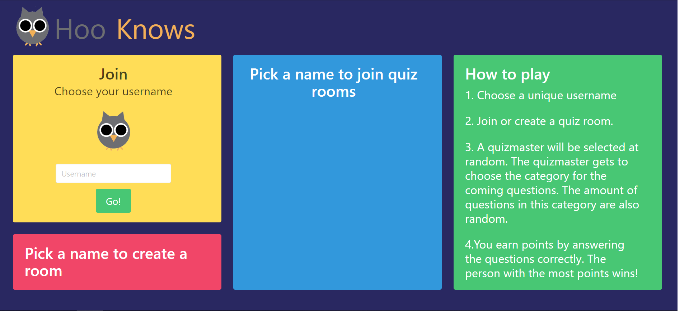
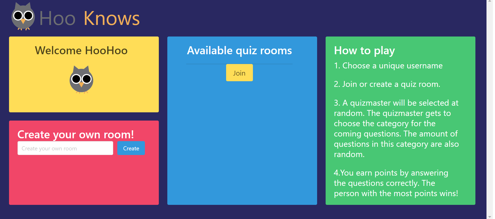
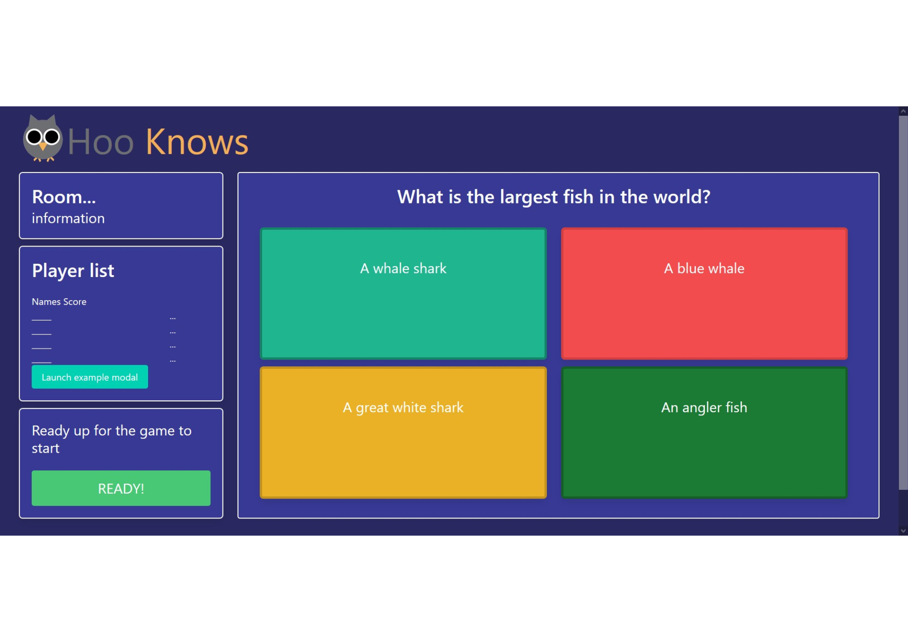

# WEBIK_Hooknows_2020
Trivia Project for Webik 2020 @uva


## Project setup
```
npm install
pip install -r requirements.txt
```

### Compiles and hot-reloads for development
```
npm run serve (frontend)
```

### Compiles and minifies for production
```
npm run build
```

### Lints and fixes files
```
npm run lint
```

### Flask api server
```
python application.py (backend)
```
# Projectleden

- Steijn Wehman 
- Sam Bijhouwer
- Sascha Kolthof
- Anasimon Wissa

# Samenvatting

Hoo Knows is een multiplayer Trivia spel. Spelers kunnen een unieke username aanmaken en een room aanmaken
of een al bestaande room joinen. In deze room zitten in totaal 2-4 spelers. Er wordt een random quizmaster gekozen, die de categorie mag bepalen voor de volgende vraag. Alle spelers krijgen dezelfde vraag te zien uit de gekozen categorie. De eerste speler met 10 punten is de winnaar van de room.

# Views
- Zie doc

# Features

- Username bedenken
- Room aanmaken
- Room joinen
- The Quizmaster

# MVP

De volgende functies moeten worden geimplementeerd worden om aan onze minimale eisen te voldoen.
- usernames kunnen kiezen
- quizmaster
- rooms maken/joinen
- Vragen kunnen beantwoorden

# Afhankelijkheden

- bulma.io
- opentdb.com
- github
- vuejs.org
- flask(socket.io)

# Concurrerende websites

- kahoot.com
- vraevrae.nl

# Controllers

- index
    This is the main page, here you can create a room, join a room and choose your username
- game
    This is the page where the rooms are hosted and the game takes place.
- scoreboard
    A page that displays the winner(s) and total scores after a game has ended


# Plugins and frameworks

- Flask
    https://flask.palletsprojects.com/en/1.1.x/
- SocketIO
    https://socket.io/docs/
- bulma
    https://bulma.io/documentation/
- Vue
    https://vuejs.org/v2/guide/
- Vue Router
    https://router.vuejs.org/
- Vuex
    https://vuex.vuejs.org/
- Vue-socket.io
    https://github.com/MetinSeylan/Vue-Socket.io

# Schetsen
homepage before username

homepage after username

game lobby


